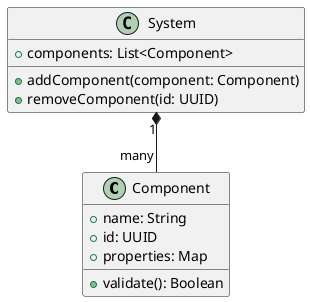
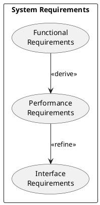

# Model-Based Development and UML Guide

## Introduction
Model-Based Development (MBD) is an approach that uses visual modeling languages and tools to design, analyze, and implement systems. This guide covers essential concepts and practices applicable across different domains.

## Core Modeling Languages

### 1. UML (Unified Modeling Language)


#### Common Diagram Types:
1. **Class Diagrams**
   - Structure and relationships
   - Attributes and operations
   - Inheritance and associations

2. **Sequence Diagrams**
   - Object interactions
   - Message flow
   - Timing constraints

3. **State Machine Diagrams**
   - System states
   - Transitions
   - Events and triggers

### 2. SysML (Systems Modeling Language)
Extended from UML for systems engineering:

1. **Requirements Diagrams**


2. **Parametric Diagrams**
   - Constraints
   - Engineering equations
   - Performance parameters

## Model-Based Development Process

### 1. Requirements Modeling
```python
class RequirementsModel:
    def __init__(self):
        self.requirements = []
        self.relationships = []
    
    def add_requirement(self, req):
        """Add a requirement with validation"""
        if self.validate_requirement(req):
            self.requirements.append(req)
    
    def establish_relationship(self, source, target, type):
        """Create relationships between requirements"""
        self.relationships.append({
            'source': source,
            'target': target,
            'type': type
        })
```

### 2. System Architecture
```python
class SystemArchitecture:
    def __init__(self):
        self.components = {}
        self.interfaces = {}
        self.flows = []
    
    def add_component(self, name, properties):
        """Define system component"""
        self.components[name] = {
            'properties': properties,
            'interfaces': [],
            'behaviors': []
        }
    
    def define_interface(self, name, protocol):
        """Specify component interfaces"""
        self.interfaces[name] = {
            'protocol': protocol,
            'signals': [],
            'data_types': []
        }
```

### 3. Behavioral Modeling
```python
class BehavioralModel:
    def __init__(self):
        self.states = {}
        self.transitions = []
        self.events = []
    
    def add_state(self, name, entry_actions=None, exit_actions=None):
        """Define system state"""
        self.states[name] = {
            'entry_actions': entry_actions or [],
            'exit_actions': exit_actions or [],
            'do_activities': []
        }
    
    def add_transition(self, source, target, trigger, guard=None):
        """Define state transition"""
        self.transitions.append({
            'source': source,
            'target': target,
            'trigger': trigger,
            'guard': guard
        })
```

## Best Practices

### 1. Model Organization
- Use hierarchical decomposition
- Maintain consistent naming conventions
- Document assumptions and constraints
- Version control your models

### 2. Model Validation
```python
class ModelValidator:
    def validate_structure(self, model):
        """Validate model structure"""
        return {
            'completeness': self.check_completeness(model),
            'consistency': self.check_consistency(model),
            'correctness': self.check_correctness(model)
        }
    
    def validate_behavior(self, model):
        """Validate behavioral aspects"""
        return {
            'reachability': self.check_state_reachability(model),
            'deadlock_free': self.check_deadlocks(model),
            'liveness': self.check_liveness(model)
        }
```

### 3. Model Reviews
- Regular peer reviews
- Automated checks
- Traceability analysis
- Impact analysis

## Integration Approaches

### 1. Tool Integration
```python
class ToolIntegration:
    def export_model(self, format):
        """Export to different tools"""
        exporters = {
            'xmi': self.export_xmi,
            'json': self.export_json,
            'yaml': self.export_yaml
        }
        return exporters[format]()
    
    def import_model(self, source, format):
        """Import from different tools"""
        importers = {
            'xmi': self.import_xmi,
            'json': self.import_json,
            'yaml': self.import_yaml
        }
        return importers[format](source)
```

### 2. Process Integration
```python
class ProcessIntegration:
    def integrate_with_lifecycle(self, model, phase):
        """Integrate with development lifecycle"""
        phases = {
            'requirements': self.requirements_phase,
            'design': self.design_phase,
            'implementation': self.implementation_phase,
            'testing': self.testing_phase
        }
        return phases[phase](model)
```

## Model-Based Testing

### 1. Test Generation
```python
class TestGenerator:
    def generate_tests(self, model):
        """Generate tests from model"""
        return {
            'unit_tests': self.generate_unit_tests(model),
            'integration_tests': self.generate_integration_tests(model),
            'system_tests': self.generate_system_tests(model)
        }
```

### 2. Test Coverage Analysis
```python
class CoverageAnalyzer:
    def analyze_coverage(self, model, test_suite):
        """Analyze test coverage"""
        return {
            'state_coverage': self.analyze_state_coverage(model, test_suite),
            'transition_coverage': self.analyze_transition_coverage(model, test_suite),
            'requirement_coverage': self.analyze_requirement_coverage(model, test_suite)
        }
```

## Documentation Generation

### 1. Model Documentation
```python
class DocumentationGenerator:
    def generate_docs(self, model):
        """Generate comprehensive documentation"""
        return {
            'architecture': self.generate_architecture_docs(model),
            'interfaces': self.generate_interface_docs(model),
            'behaviors': self.generate_behavior_docs(model)
        }
```

### 2. Report Generation
```python
class ReportGenerator:
    def generate_reports(self, model, analysis_results):
        """Generate analysis reports"""
        return {
            'validation_report': self.generate_validation_report(model),
            'coverage_report': self.generate_coverage_report(analysis_results),
            'metrics_report': self.generate_metrics_report(model)
        }
```

## Getting Started

1. Choose appropriate modeling languages (UML/SysML)
2. Select compatible modeling tools
3. Define modeling guidelines
4. Set up version control
5. Establish review processes
6. Implement continuous integration

## Resources

- UML Specification: [OMG UML](https://www.omg.org/spec/UML)
- SysML Specification: [OMG SysML](https://www.omg.org/spec/SysML)
- Model-Based Testing: [ISTQB](https://www.istqb.org)
- Tool Guides: [Various Modeling Tools](#)
- Community Forums: [Model-Based Systems Engineering](#)
