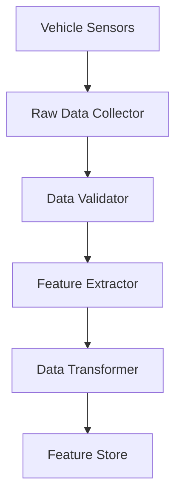
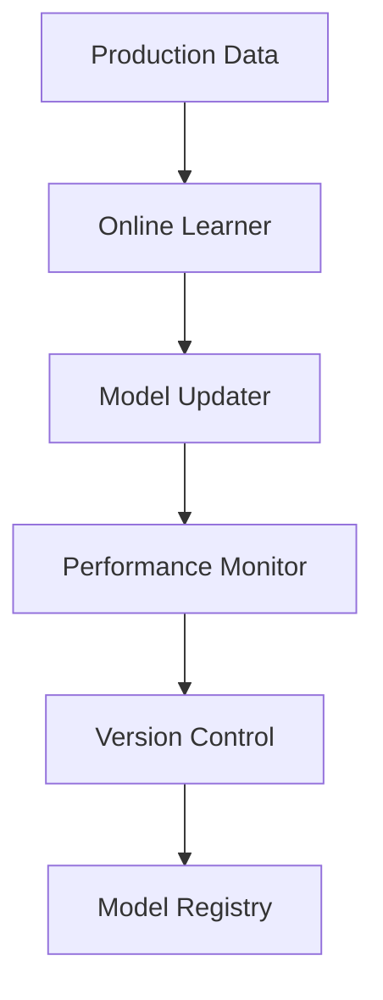

# ML Training and Deployment Workflow

## 1. Data Collection Pipeline

### 1.1 Sensor Data Collection

### 1.2 Data Processing Steps
- Raw data validation
- Feature extraction
- Data normalization
- Feature engineering
- Data augmentation

### 1.3 Quality Checks
- Data completeness
- Sensor accuracy
- Signal-to-noise ratio
- Feature correlation
- Distribution analysis

## 2. Model Training Pipeline

### 2.1 Training Workflow

### 2.2 Model Types
- Anomaly Detection: Isolation Forest
- Trend Analysis: LSTM Networks
- Predictive Maintenance: Random Forest
- Resource Optimization: Reinforcement Learning
- Pattern Recognition: Convolutional Neural Networks

### 2.3 Training Parameters
- Batch size: 64-256
- Learning rate: 0.001-0.0001
- Epochs: 100-1000
- Validation split: 20%
- Early stopping patience: 10

## 3. Model Deployment

### 3.1 Deployment Steps
1. Model validation
2. A/B testing
3. Canary deployment
4. Performance monitoring
5. Rollback procedures

### 3.2 Production Requirements
- Inference latency < 100ms
- Model size < 100MB
- Memory usage < 2GB
- CPU usage < 30%
- GPU optimization enabled

## 4. Online Learning

### 4.1 Continuous Learning Pipeline

### 4.2 Update Criteria
- Performance degradation > 5%
- Data drift detection
- Concept drift detection
- Resource usage optimization
- Error rate threshold
