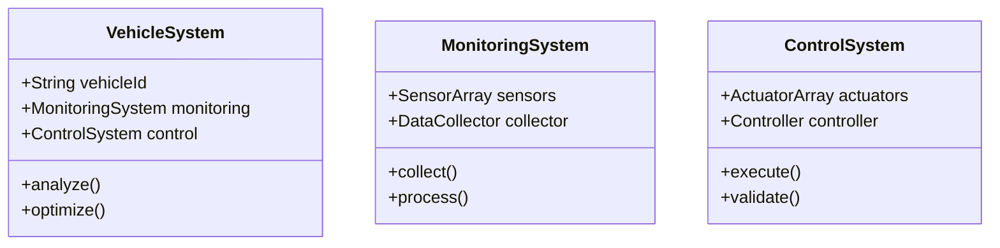

# Model-Based Design Implementation Plan

## 1. UML Architecture Setup

### 1.1 System Structure Modeling


### 1.2 Core UML Components
- [ ] Class Diagrams
  - Vehicle system architecture
  - Sensor network topology
  - Control system hierarchy
  - Data flow structures

- [ ] Sequence Diagrams
  - Real-time monitoring flow
  - Control system interactions
  - Data collection sequences
  - Error handling procedures

- [ ] State Diagrams
  - Vehicle operational states
  - System mode transitions
  - Error state handling
  - Recovery procedures

- [ ] Activity Diagrams
  - Maintenance workflows
  - Optimization processes
  - Data analysis pipelines
  - User interaction flows

## 2. Autodesk Integration Pipeline

### 2.1 AutoCAD Implementation
- [ ] Component Design
  - Detailed technical drawings
  - Component specifications
  - Assembly instructions
  - Tolerance definitions

- [ ] API Integration
  ```python
  from pyautocad import Autocad
  
  class AutoCADInterface:
      def __init__(self):
          self.acad = Autocad()
          self.doc = self.acad.ActiveDocument
          
      def update_component(self, component_id, specs):
          # Update component specifications
          model_space = self.doc.ModelSpace
          component = model_space.Item(component_id)
          self.apply_specs(component, specs)
  ```

### 2.2 Fusion 360 Pipeline
- [ ] 3D Modeling
  - Component modeling
  - Assembly creation
  - Motion studies
  - Stress analysis

- [ ] Cloud Integration
  ```python
  from fusion360api import Fusion360AppInterface
  
  class Fusion360Pipeline:
      def __init__(self, credentials):
          self.app = Fusion360AppInterface(credentials)
          self.project = self.app.active_project
          
      def sync_model(self, model_data):
          # Synchronize model with real-time data
          design = self.project.active_design
          parameters = design.user_parameters
          self.update_parameters(parameters, model_data)
  ```

### 2.3 Inventor Integration
- [ ] Mechanical Design
  - Part modeling
  - Assembly modeling
  - Engineering drawings
  - Bill of materials

- [ ] Analysis Tools
  ```python
  from inventor_api import InventorApp
  
  class InventorAnalysis:
      def __init__(self):
          self.app = InventorApp()
          self.doc = self.app.active_document
          
      def perform_analysis(self, parameters):
          # Run mechanical analysis
          analysis = self.doc.analyses.add()
          analysis.set_parameters(parameters)
          results = analysis.run()
          return self.process_results(results)
  ```

## 3. Digital Twin Implementation

### 3.1 Real-time Synchronization
```python
class DigitalTwin:
    def __init__(self, vehicle_id):
        self.vehicle_id = vehicle_id
        self.cad_model = AutoCADInterface()
        self.fusion_model = Fusion360Pipeline()
        self.inventor_model = InventorAnalysis()
        
    def sync_with_physical(self, telemetry_data):
        # Update digital models with physical data
        self.update_cad(telemetry_data)
        self.update_fusion(telemetry_data)
        self.update_inventor(telemetry_data)
        
    def predict_maintenance(self):
        # Analyze current state and predict maintenance needs
        current_state = self.get_current_state()
        analysis_results = self.inventor_model.perform_analysis(current_state)
        return self.generate_maintenance_schedule(analysis_results)
```

### 3.2 Simulation Environment
- [ ] Physics Engine Integration
  - Real-time physics simulation
  - Environmental factors
  - Component interactions
  - Performance modeling

- [ ] Data Integration
  ```python
  class SimulationEnvironment:
      def __init__(self):
          self.physics_engine = PhysicsEngine()
          self.environment = Environment()
          self.data_collector = DataCollector()
          
      def run_simulation(self, scenario):
          # Execute simulation with given parameters
          initial_state = self.setup_scenario(scenario)
          simulation = self.physics_engine.simulate(initial_state)
          results = self.data_collector.collect(simulation)
          return self.analyze_results(results)
  ```

## 4. Integration Testing Framework

### 4.1 Component Testing
```python
class ModelTestFramework:
    def __init__(self):
        self.cad_tester = CADTester()
        self.fusion_tester = FusionTester()
        self.inventor_tester = InventorTester()
        
    def run_integration_tests(self):
        # Test all component integrations
        cad_results = self.cad_tester.test_integration()
        fusion_results = self.fusion_tester.test_integration()
        inventor_results = self.inventor_tester.test_integration()
        return self.compile_results([cad_results, fusion_results, inventor_results])
```

### 4.2 Validation Framework
- [ ] Model Validation
  - Geometric validation
  - Physical properties
  - Performance characteristics
  - Tolerance verification

- [ ] Data Validation
  ```python
  class ValidationFramework:
      def __init__(self):
          self.validators = {
              'geometry': GeometryValidator(),
              'physics': PhysicsValidator(),
              'performance': PerformanceValidator()
          }
          
      def validate_model(self, model_data):
          # Validate model against specifications
          validation_results = {}
          for validator_name, validator in self.validators.items():
              validation_results[validator_name] = validator.validate(model_data)
          return self.generate_validation_report(validation_results)
  ```

## 5. Deployment Pipeline

### 5.1 Continuous Integration
```python
class ModelDeploymentPipeline:
    def __init__(self):
        self.test_framework = ModelTestFramework()
        self.validation_framework = ValidationFramework()
        self.deployment_manager = DeploymentManager()
        
    def deploy_model_updates(self, updates):
        # Deploy model updates through CI/CD pipeline
        test_results = self.test_framework.run_integration_tests()
        if test_results.passed:
            validation_results = self.validation_framework.validate_model(updates)
            if validation_results.valid:
                return self.deployment_manager.deploy(updates)
        return False
```

### 5.2 Version Control
- [ ] Model Version Control
  - CAD file versioning
  - Assembly versioning
  - Change tracking
  - Rollback capabilities

## 6. Documentation Generation

### 6.1 Technical Documentation
```python
class DocumentationGenerator:
    def __init__(self):
        self.doc_builder = DocumentBuilder()
        self.uml_generator = UMLGenerator()
        self.spec_generator = SpecificationGenerator()
        
    def generate_documentation(self):
        # Generate comprehensive documentation
        uml_docs = self.uml_generator.generate_diagrams()
        specs = self.spec_generator.generate_specs()
        return self.doc_builder.compile_documentation(uml_docs, specs)
```

### 6.2 User Guides
- [ ] System Documentation
  - Installation guides
  - Configuration manuals
  - Operation procedures
  - Troubleshooting guides
